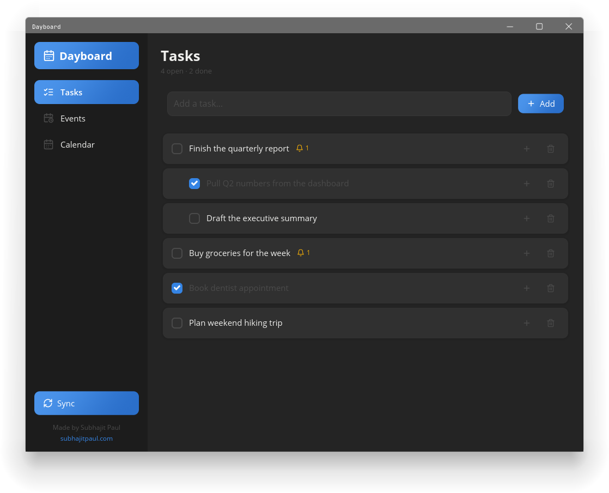
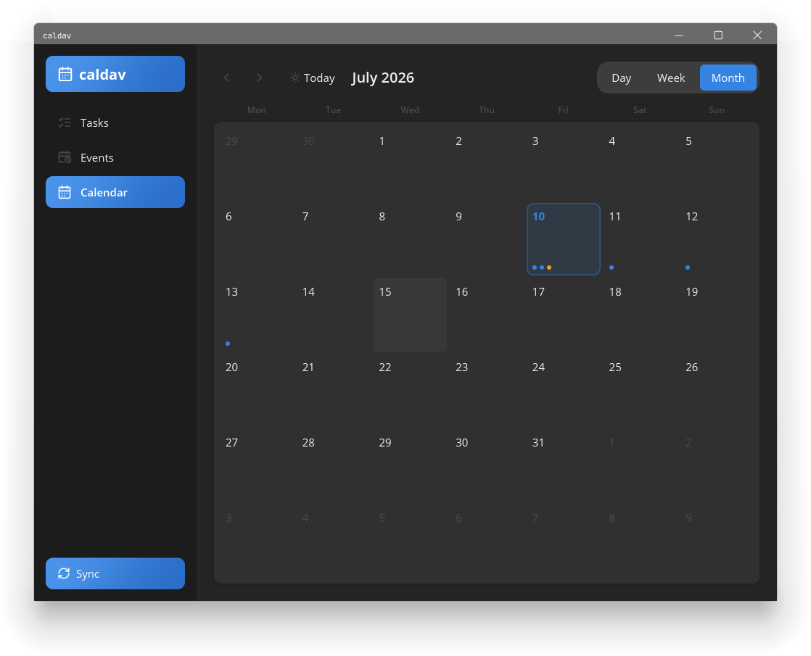
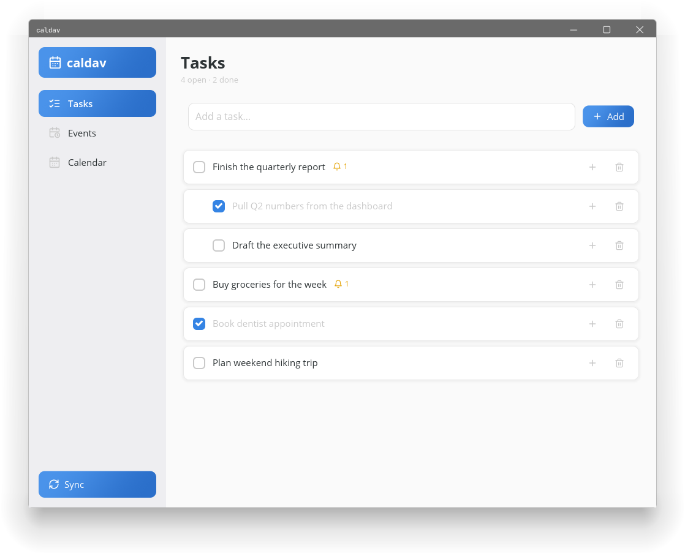
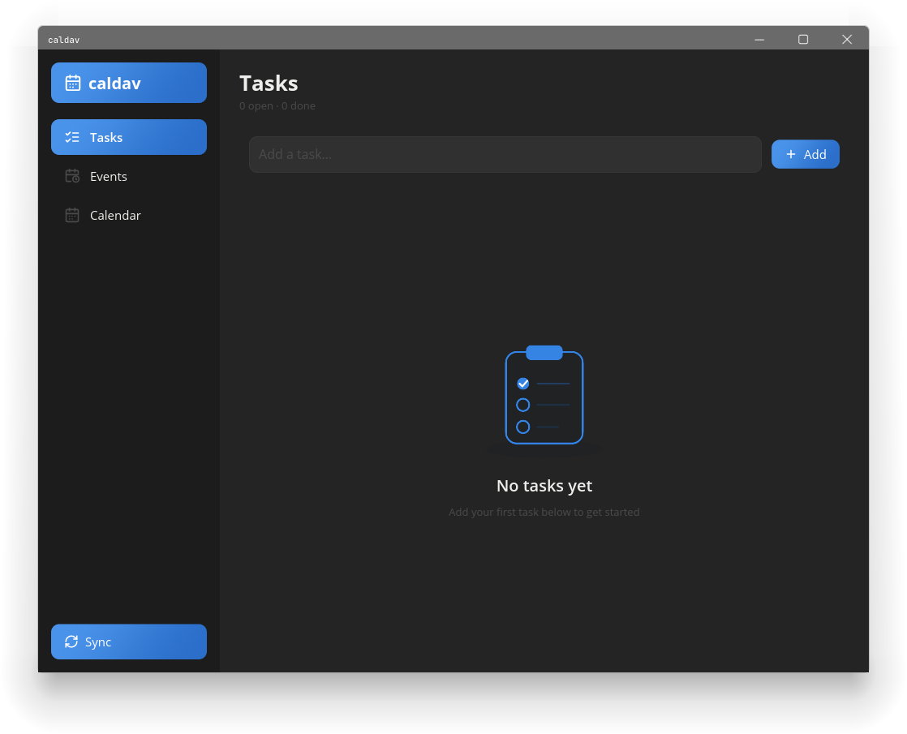
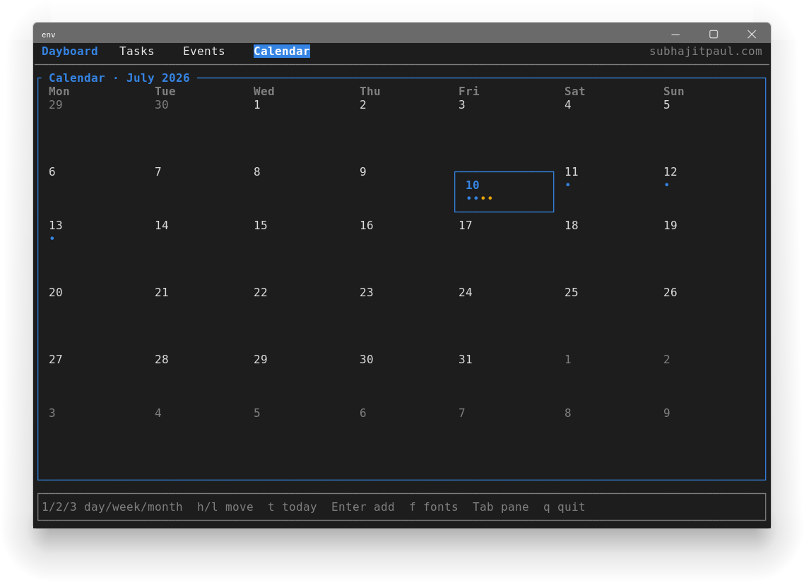
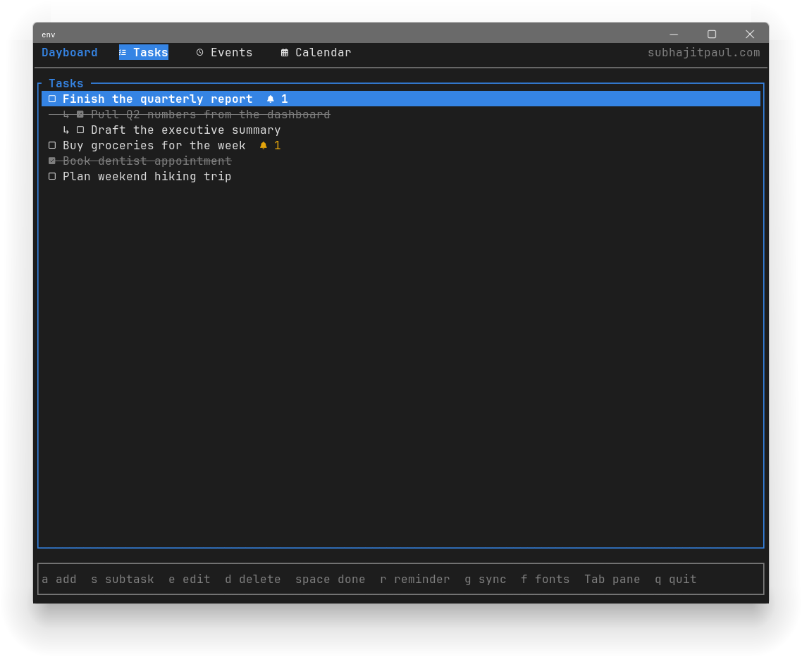

# Dayboard

**Everything, one board.** A native Linux calendar, tasks, and reminders app —
local-first in SQLite, with optional two-way sync to Google Calendar and Google
Tasks. Ships two frontends over one shared core: a rich **GUI** (built with
[iced](https://iced.rs)) and a fast **TUI** (built with
[ratatui](https://ratatui.rs)).

<p align="center">
  
  
</p>

## Features

- **Tasks & subtasks** — one level of nesting, done-toggle, inline add/edit/delete.
- **Events** — title + start/end, a Day/Week/Month calendar preview.
- **Reminders** — attach one or more to any task; a background daemon fires
  desktop notifications when they're due.
- **Two-way Google sync** — events ↔ Google Calendar, tasks/subtasks ↔ Google
  Tasks. Last-write-wins conflict resolution; deletions propagate.
- **Local-first** — a single SQLite file (WAL mode); the GUI, TUI, and daemon
  all open it directly, no server or IPC layer.
- **Light & dark** — the GUI tracks your OS light/dark preference (GNOME Adwaita
  accent). The TUI has an opt-in **Nerd Font** glyph mode.

<p align="center">
  
  
</p>
<p align="center">
  
  
</p>

## Install

### APT (Debian/Ubuntu, x86_64)

```bash
curl -fsSL https://subhajit-paul.github.io/dayboard/dayboard-archive-keyring.gpg \
  | sudo tee /usr/share/keyrings/dayboard-archive-keyring.gpg > /dev/null
echo "deb [arch=amd64 signed-by=/usr/share/keyrings/dayboard-archive-keyring.gpg] https://subhajit-paul.github.io/dayboard stable main" \
  | sudo tee /etc/apt/sources.list.d/dayboard.list
sudo apt update
sudo apt install dayboard-gui   # or dayboard-tui; both pull in dayboard-daemon
```

Each of the three is a separate package. `dayboard-gui` and `dayboard-tui`
each depend on `dayboard-daemon` (for background reminders and sync), so
installing either pulls it in automatically; `dayboard-daemon` can also be
installed on its own for a headless setup. The repo is signed and updated
automatically on every release.

### From source

Requires **Rust 1.85+** (2024 edition). The GUI additionally needs the usual
Linux windowing libraries at runtime (Wayland or X11, `libxkbcommon`).

```bash
git clone https://github.com/Subhajit-Paul/dayboard.git
cd dayboard
cargo build --workspace --release
```

Binaries land in `target/release/` as `gui`, `tui`, and `daemon`.

## Run

```bash
cargo run -p gui      # the graphical app
cargo run -p tui      # the terminal app
```

### Reminder + sync daemon

```bash
cargo run -p daemon -- --install   # write & enable a systemd --user unit (caldavd)
cargo run -p daemon -- --auth      # run the interactive Google OAuth flow
```

`--install` registers a `systemd --user` service that polls for due reminders
and (once connected) periodically syncs. Check it with
`systemctl --user status caldavd`.

## Google sync setup

1. In the [Google Cloud Console](https://console.cloud.google.com/), create an
   OAuth client of type **Desktop app** and download its JSON.
2. Save it to `$XDG_CONFIG_HOME/caldav/google_client.json`
   (usually `~/.config/caldav/google_client.json`).
3. Run `cargo run -p daemon -- --auth` and complete the browser flow. Tokens are
   cached (mode `0600`) as `tokens.json` alongside the client file.

## Configuration

| Variable            | Default | What it does                                             |
|---------------------|---------|----------------------------------------------------------|
| `CALDAV_POLL_SECS`  | `30`    | How often the daemon checks for due reminders.           |
| `CALDAV_SYNC_SECS`  | `300`   | How often the daemon syncs with Google (once connected). |
| `CALDAV_TUI_NERD`   | unset   | Set to `1` to default the TUI's Nerd Font glyphs on.     |

**Data** lives at `$XDG_DATA_HOME/caldav/caldav.db` (usually
`~/.local/share/caldav/caldav.db`).

## TUI keys

`a` add · `s` subtask · `e` edit · `d` delete · `space` toggle done · `r` reminder ·
`v` add event · `g` sync · `f` toggle Nerd Font glyphs · `Tab` switch pane ·
`1`/`2`/`3` Day/Week/Month · `h`/`l` move cursor · `t` today · `q` quit.

## Architecture

A Cargo workspace with four members; `core` holds all the real logic and is the
only crate with tests.

| Crate    | Package        | Role                                                          |
|----------|----------------|--------------------------------------------------------------|
| `core`   | `caldav_core`  | `Db` (SQLite), models, Google OAuth + two-way sync.          |
| `daemon` | `daemon`       | Reminder notifications + periodic sync; installs a systemd unit. |
| `tui`    | `tui`          | ratatui terminal frontend.                                   |
| `gui`    | `gui`          | iced graphical frontend.                                      |

> The crate/package names, the on-disk database path, and the `caldavd` CLI keep
> the original `caldav` name; **Dayboard** is the product/display name.

## Development

```bash
cargo test --workspace        # core has the main suite; gui has date-math tests
cargo clippy --all-targets    # kept warning-free
cargo fmt
```

## Releases

Pushing a `v*` tag (e.g. `git tag v0.1.0 && git push origin v0.1.0`) triggers the
release workflow: it builds the workspace in release mode and, on success,
publishes the Linux binaries as a GitHub Release archive. See
[`.github/workflows`](.github/workflows).

## Credits

Built by **Subhajit Paul** — [subhajitpaul.com](https://subhajitpaul.com).
